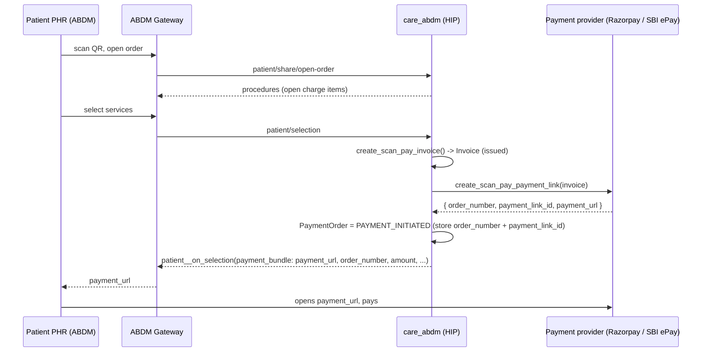
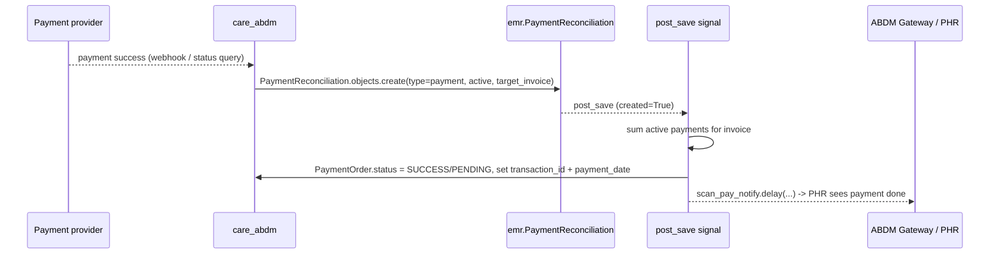

# Scan & Pay — Payment Link Generation, Verification, and Provider Support

Status: living document. Sections 1–3 describe what is **implemented today**; Section 4 is a
**Work In Progress** proposal for extracting payment into its own plug.

Scope: the "scan & pay" flow in the `care_abdm` plugin (patient scans a QR at the facility,
picks the services to pay for, pays via a gateway, and the facility's invoice is reconciled).

---

## 1. How the payment link is generated

Scan & pay is driven by ABDM gateway callbacks. The link is created during the
**patient selection** step.

Sequence:



Key code (all in `care_abdm/abdm/service/v3/`):

1. **`callback_handlers/scan_pay.py :: handle_patient_selection`**
   - Validates the open order + selected `ChargeItem`s (single account, still billable).
   - `create_scan_pay_invoice(...)` → creates an `emr.Invoice` (status `issued`), marks charge
     items `billed`, syncs invoice items, and rebalances the account.
   - `payment = create_scan_pay_payment_link(invoice)`.
   - Persists on the `PaymentOrder`: `order_number`, `payment_link_id`, `status = PAYMENT_INITIATED`.
   - Sends the `payment_bundle` back to the PHR via `GatewayService.patient__on_selection`
     (`payment_url`, `order_number`, `amount`, `merchant_id`, `description`).

2. **`scan_pay.py :: create_scan_pay_payment_link(invoice)`** — the single provider entry point.
   Returns a **normalized dict** for every provider:
   ```python
   { "order_number": <str>, "payment_link_id": <str>, "payment_url": <str> }
   ```
   - Razorpay → `payment_link.create(...)`; `order_number = invoice.number`, `payment_link_id = link.id`,
     `payment_url = link.short_url`.
   - SBI ePay → `sbi_epay.create_payment_link(...)`; `order_number` = a fresh 15-char alphanumeric
     `merchOrderNo`, `payment_link_id = payment_url = res.paymentUrl`.

`order_number` is the join key used later for verification, so it is always stored on the
`PaymentOrder` and echoed to the PHR.

---

## 2. How payment is verified (reconciliation)

Verification is **provider-agnostic at its core**: whichever provider confirms a payment,
it results in a `emr.PaymentReconciliation` row, and a single ABDM signal turns that into a
`PaymentOrder` status update + a PHR notification.



### 2a. Primary path — provider push webhook (SBI ePay)
- Endpoint: `POST /api/abdm/v3/sbi-epay/webhook/` (`SbiEpayViewSet.webhook`, unauthenticated).
- SBI posts `application/x-www-form-urlencoded` with `pushRespData` (AES-encrypted, same merchant key).
- `sbi_epay.parse_push_response(pushRespData)`:
  - AES-CBC decrypt → a **pipe-delimited** string whose **last field is a SHA-512 checksum**.
  - **Validates the checksum** (`sha512(everything up to & including the pipe before it)`) — this is
    the authenticity/tamper check, since only we and SBI hold the merchant key.
  - Returns a dict keyed by `PUSH_FIELDS` (`merch_order_no`, `atrn`, `status`, `amount`, `pay_mode`,
    `bank_ref_number`, `cin`, …).
- `reconcile_sbi_epay_push(push)`:
  - Finds the `PaymentOrder` by `order_number == merch_order_no` (excludes already-paid).
  - If `status == "SUCCESS"` → `_create_sbi_epay_reconciliation(order, atrn or bank_ref_number)`.

### 2b. Fallback path — Status Query (manual / on-demand)
- `reconcile_sbi_epay_order(order)` calls `sbi_epay.status_query(merchOrderNo, amount)`.
- On `Response Status == "SUCCESS"` it creates the same `PaymentReconciliation`.
- Kept for **manual intervention** (e.g. a missed webhook). It is no longer auto-triggered on the
  ABDM order-status callback.

### 2c. The shared reconciliation + signal (the "standard")
`_create_sbi_epay_reconciliation(order, reference)` creates:
```python
PaymentReconciliation.objects.create(
    facility, target_invoice, account,
    reconciliation_type = payment, status = active, kind = online,
    issuer_type = patient, outcome = complete, method = ccca,
    reference_number = <ATRN / bank ref>, amount = tendered = invoice.total_gross,
    payment_datetime = now, created_by = <abdm internal user>,
)
rebalance_account_task.delay(invoice.account_id)   # keeps the account balance correct
```
Then the receiver `abdm/signals/scan_pay.py :: notify_scan_pay_payment` (post_save on
`PaymentReconciliation`, `created=True`, `target_invoice` set):
- Sums all `active` `payment` reconciliations for the invoice.
- Sets `PaymentOrder.status = SUCCESS` if total ≥ `invoice.total_gross` else `PENDING`,
  plus `transaction_id` and `payment_date`.
- Enqueues `scan_pay_notify` → notifies the PHR.

**This is exactly how Razorpay works too** — `care_razorpay`'s webhook (`payment_link.paid` /
`qr_code.credited`) creates a `PaymentReconciliation` (+ `rebalance_account_task`), and the same
signal reacts. Nothing in the reconciliation → order → notify chain is provider-specific.

---

## 3. How multiple providers are supported (today)

Selection is a single config switch; the rest of the flow is uniform.

- **Config** (`abdm/settings.py` DEFAULTS, overridable via env / `PLUGIN_CONFIGS["abdm"]`):
  - `ABDM_SCAN_AND_PAY_PROVIDER` = `"razorpay"` (default) | `"sbi_epay"`.
  - Razorpay: `ABDM_RAZORPAY_KEY_ID/SECRET`.
  - SBI ePay: `ABDM_SBI_EPAY_BASE_URL / API_KEY_ID / API_SECRET_KEY / MERCHANT_CODE / MERCHANT_KEY / SOURCE_URL`.
  - The payment bundle's `merchantId` is the facility's HIP id (`HealthFacility.hf_id`).
- **Dispatch**: `create_scan_pay_payment_link()` branches on the provider and returns the
  **same normalized contract** `{order_number, payment_link_id, payment_url}`, so the callback
  handler is provider-independent.
- **Reconciliation**: provider-agnostic by construction — every provider funnels into
  `PaymentReconciliation` + the one signal. Providers differ only in *how* they detect success
  (Razorpay webhook events vs SBI push webhook / status query).

Provider-specific pieces:

| Concern                | Razorpay                                  | SBI ePay                                             |
|------------------------|-------------------------------------------|------------------------------------------------------|
| Link creation          | `_create_razorpay_payment_link`           | `_create_sbi_epay_payment_link` (`utils/sbi_epay.py`)|
| Crypto                 | none (REST + webhook signature)           | AES-CBC + SHA-512 (`utils/sbi_epay_crypto.py`)       |
| Success detection      | webhook (`payment_link.paid` …)           | push webhook `pushRespData` + status query fallback  |
| Reconciliation created | `care_razorpay` webhook viewset           | `care_abdm` (`reconcile_sbi_epay_push/_order`)       |
| PaymentOrder + notify  | shared signal                             | shared signal                                        |

> Note: today the SBI provider lives **inside** `care_abdm`, while Razorpay lives in its own
> `care_razorpay` plug. Section 4 proposes normalizing this.

---

## 4. WIP — Extracting payment into its own plug (modular, no hard imports)

**Goal:** move payment providers (SBI ePay, Razorpay, future) into a dedicated, optionally-installed
plug (e.g. `care_payments`), so `care_abdm` does not carry gateway code and other domains can reuse
payments. **Constraint:** the payment plug is installed *on demand* (via `plug_config.py` /
`ADDITIONAL_PLUGS`), so `care_abdm` must **never `import` it directly** — the import may not exist.

### 4.1 What is already decoupled (reuse as-is)
The **verification** side needs no changes: it is glued through the shared `emr.PaymentReconciliation`
model + the `post_save` signal. The payment plug's webhook just creates a `PaymentReconciliation`;
`care_abdm`'s signal reacts. No cross-plug import.

Only the **link-generation call is a synchronous, cross-plug call** (`care_abdm` needs to *ask* the
payment plug for a link and get a value back). That is the one seam to design.

### 4.2 Recommended: an **abdm-owned** Scan & Pay provider registry

Keep everything in `care_abdm` — **no change to care core**. `care_abdm` exposes the registry and
the contract. This is deliberately scoped: the contract returns exactly what the ABDM PHR bundle
needs (`order_number`, `payment_url`), so it is a scan-and-pay concern, not a generic-payments one.
That scoping is correct, not niche. care already uses registries this way
(`ExtensionRegistry`, `DeviceTypeRegistry` in `care/emr/registries/…`) — we simply host ours in abdm.

The contract (a plain interface, lives in abdm, e.g. `abdm/service/v3/scan_pay_providers.py`):
```python
class ScanPayProvider:
    key: str  # "sbi_epay" | "razorpay"
    def create_payment_link(self, invoice) -> dict:
        """Return {"order_number", "payment_link_id", "payment_url"}."""
        raise NotImplementedError
```

Two ways to wire providers without a hard cross-plug import. **Pick one; keep the dependency
one-directional** (never abdm⟶provider *and* provider⟶abdm).

**Option A — settings dotted-path (recommended; reuses abdm's existing `perform_import`).**
- abdm setting (default has the in-repo providers; a plug can override via `PLUGIN_CONFIGS`/env):
  ```python
  ABDM_SCAN_AND_PAY_PROVIDERS = {
      "sbi_epay": "care_payments.providers.SbiEpayProvider",
      "razorpay": "care_payments.providers.RazorpayProvider",
  }
  ```
- abdm resolves the **selected** provider lazily with DRF `perform_import` (the same mechanism
  `PluginSettings.import_strings` already uses). The provider plug is a plain class and does **not**
  import abdm; abdm touches it only by string, only when chosen, guarded:
  ```python
  def create_scan_pay_payment_link(invoice):
      dotted = settings.ABDM_SCAN_AND_PAY_PROVIDERS.get(settings.ABDM_SCAN_AND_PAY_PROVIDER)
      try:
          provider_cls = perform_import(dotted, "ABDM_SCAN_AND_PAY_PROVIDERS")
      except ImportError:      # plug not installed / bad path
          raise ScanPayProviderUnavailable(settings.ABDM_SCAN_AND_PAY_PROVIDER)
      return provider_cls().create_payment_link(invoice)   # normalized dict, unchanged
  ```

**Option B — explicit registry + `register()` at `ready()`.**
- abdm exposes `ScanPayProviderRegistry.register(...)` / `.get(key)`.
- The provider plug registers in its `apps.py :: ready()` (runs only if installed):
  ```python
  # care_payments/apps.py
  def ready(self):
      from abdm.service.v3.scan_pay_providers import ScanPayProviderRegistry
      from care_payments.providers import SbiEpayProvider
      ScanPayProviderRegistry.register(SbiEpayProvider())
  ```
- Here the direction is provider ⟶ abdm, which is acceptable because payment is scan-pay-scoped.
- abdm consumes `ScanPayProviderRegistry.get(settings.ABDM_SCAN_AND_PAY_PROVIDER)`; `None` ⟶ graceful
  "provider unavailable" (the selection handler already surfaces "Failed to create payment link").

Either way, verification stays untouched (Section 4.1): the provider plug's webhook creates a
`PaymentReconciliation`, and abdm's existing signal reacts — no import needed on that path.

### 4.3 Alternative considered
- **Django signal request/response**: define `scan_pay_link_requested = Signal()` in abdm; the
  provider plug connects a receiver returning the link; abdm does
  `responses = scan_pay_link_requested.send(sender, invoice=…)` and takes the first non-`None`.
  Fully decoupled, but "signals that return values" is less explicit/discoverable than a registry and
  makes error handling messier. Keep as a fallback only.

### 4.4 Suggested migration steps (incremental, low-risk)
1. Add the `ScanPayProvider` contract + resolver (Option A or B) inside `care_abdm`. No behavior change:
   register the current in-repo Razorpay + SBI implementations as the two default providers.
2. Repoint `create_scan_pay_payment_link` to resolve via the registry/dotted-path instead of the
   hard `if provider == "sbi_epay"` branch.
3. (When ready) create the optional `care_payments` plug and move the provider **implementations**
   (`utils/sbi_epay.py`, `utils/sbi_epay_crypto.py`, the `create_payment_link` bodies) into it,
   plus the SBI webhook and the `reconcile_*` / `_create_*_reconciliation` helpers. The webhook still
   creates `PaymentReconciliation`; abdm's signal keeps reacting unchanged.
4. Point `ABDM_SCAN_AND_PAY_PROVIDERS` at the plug's classes. If the plug is absent, the guarded
   resolve fails gracefully.
5. Keep `PaymentOrder`, the PHR-notify signal, and the scan-pay callbacks in `care_abdm` — these are
   ABDM-domain concerns.

**Boundary after extraction:**
- `care_abdm`: the `ScanPayProvider` contract + registry, `PaymentOrder` lifecycle, scan-pay
  callbacks, PHR notification, and the `PaymentReconciliation` ⟶ `PaymentOrder` signal.
- `care_payments` (optional plug): provider clients, crypto, link creation, webhooks, and creating
  `PaymentReconciliation`. Registers against abdm's contract; abdm never hard-imports it.
- `care` core: unchanged — only the shared `emr.PaymentReconciliation` model is the glue.

> If a *generic* payments abstraction is later needed outside ABDM, promote this contract to care
> core at that point. Until then, abdm-owned is the right size.

